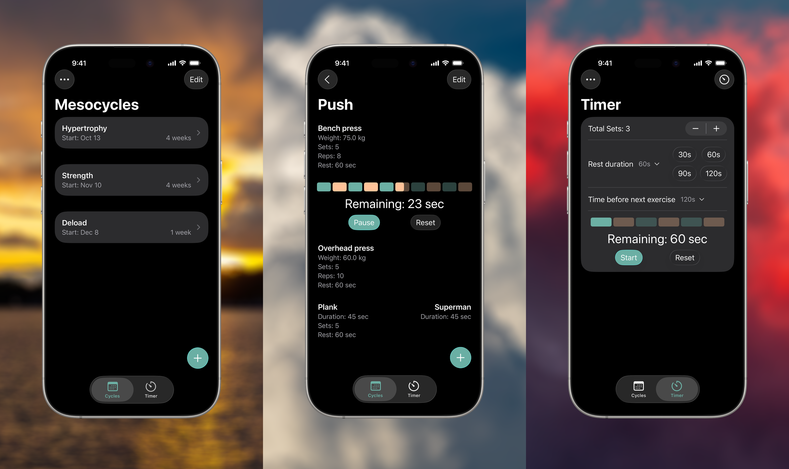

# Deadlift Diaries

This is an iOS app which allows you to plan workouts as well as track your sets and reps. You can also time your rests and play a sound at the end.

    

## Screenshots

## Features

* Plan your workouts and keep track of them while training,
* Play a sound at the end of the rest timer,
* See the history and progression of sets, reps and weights,
* Possibility to have time-based exercises instead of reps, and distance-based instead of weights.

## Credits

* Graphics:
    - [Notebook icon](https://www.svgrepo.com/svg/484727/notebook) by SVG Repo (Public Domain)
* Live Activities:
    - Thanks to Álvaro from [lvrpiz](https://apps.lvrpiz.com/) for helping me figuring out live activities.
